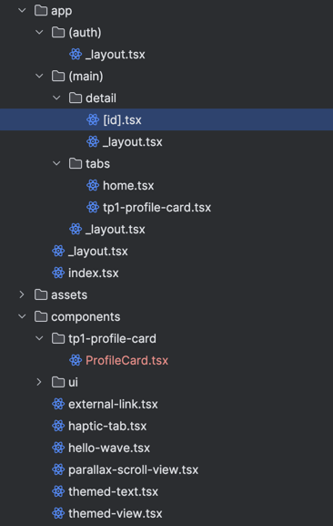

# Welcome to your Expo app 👋

This is an [Expo](https://expo.dev) project created with [`create-expo-app`](https://www.npmjs.com/package/create-expo-app).

## Get started

1. Install dependencies

   ```bash
   npm install
   ```

2. Start the app

   ```bash
   npx expo start
   ```


TP 1 : 
https://github.com/NicolasSchutz73/rn-advanced-labs/tree/main/app/tp1-profile-card
Carte de Profil Interactive (ProfileCard.tsx) :
Affiche une photo, un nom, et un titre.
Possède un compteur de "followers" qui augmente tout seul toutes les 5 secondes
Contient un bouton "Follow" / "Unfollow" qui met à jour le compteur et change de texte à chaque clic

Arborescence du dossier app : 


TP2 : 

Ce qui est persistant :
La dernière route visitée (pathname) est sauvegardée dans AsyncStorage à chaque changement de page.
Lors du prochain lancement de l’application, l’utilisateur est automatiquement redirigé vers cette dernière route.

Exemple :
Si l’utilisateur était sur /tabs/home, il revient sur /tabs/home.
Si l’utilisateur était sur /detail/42?id=42, il revient sur /detail/42?id=42.



TP3 : 

Routes : 
- `/tabs/home` : Page d'accueil principale.
- `/tabs/tp1-profile-card` : Affiche la carte de profil interactive ([ProfileCard](components/tp1-profile-card/ProfileCard.tsx)).
- `/detail/[id]` : Page de détail, affiche le paramètre `id` passé dans l'URL.
- `/tp3-forms/formik` : Formulaire d'inscription utilisant Formik ([validation](app/(main)/tp3-forms/formik/validation/schema.ts)).
- `/tp3-forms/rhf` : Formulaire d'inscription utilisant React Hook Form ([validation](app/(main)/tp3-forms/rhf/validation/schema.ts)).

## UX Mobile (checks)

- Clavier ne masque rien (KAV). OK
- Focus chain : `email → password → confirm → displayName → submit`. OK
- Submit désactivé tant que non valide. OK
- Messages d’erreur clairs. OK


TP4 A : zustand 

impossible de continuer le tp à cause d'une erreur lié à une dépendance : 
entry.bundle:153281 Uncaught SyntaxError: Cannot use 'import.meta' outside a module

- Choix: React Hook Form (RHF) + Zod
- Pourquoi:
  - Performances et faible re-rendering.
  - Validation typée via Zod, réutilisable côté UI et logique métier.
  - Schéma centralisé unique: [`robotSchema`](validation/robotSchema.ts) et type [`Robot`](validation/robotSchema.ts).
  - Intégration directe via zodResolver dans le formulaire: [`RobotForm`](components/RobotForm.tsx).


## Arborescence & routes

Arborescence attendue (objectif):
```
app/(main)/tp4A-robots/
  index.tsx            # écran Liste des robots (avec Zustand)
  create.tsx           # écran Création
  edit/[id].tsx        # écran Édition
store/
  robotsStore.ts       # Zustand + persistance
validation/
  robotSchema.ts       # Zod
components/
  RobotForm.tsx        # formulaire réutilisable
  RobotListItem.tsx    # item de liste (actions Edit/Delete)
```